<div class="MCWHeader1">
Intelligent analytics
</div>

<div class="MCWHeader2">
Hands-on lab step-by-step
</div>

<div class="MCWHeader3">
March 2018
</div>


Information in this document, including URL and other Internet Web site references, is subject to change without notice. Unless otherwise noted, the example companies, organizations, products, domain names, e-mail addresses, logos, people, places, and events depicted herein are fictitious, and no association with any real company, organization, product, domain name, e-mail address, logo, person, place or event is intended or should be inferred. Complying with all applicable copyright laws is the responsibility of the user. Without limiting the rights under copyright, no part of this document may be reproduced, stored in or introduced into a retrieval system, or transmitted in any form or by any means (electronic, mechanical, photocopying, recording, or otherwise), or for any purpose, without the express written permission of Microsoft Corporation.

Microsoft may have patents, patent applications, trademarks, copyrights, or other intellectual property rights covering subject matter in this document. Except as expressly provided in any written license agreement from Microsoft, the furnishing of this document does not give you any license to these patents, trademarks, copyrights, or other intellectual property.

The names of manufacturers, products, or URLs are provided for informational purposes only and Microsoft makes no representations and warranties, either expressed, implied, or statutory, regarding these manufacturers or the use of the products with any Microsoft technologies. The inclusion of a manufacturer or product does not imply endorsement of Microsoft of the manufacturer or product. Links may be provided to third party sites. Such sites are not under the control of Microsoft and Microsoft is not responsible for the contents of any linked site or any link contained in a linked site, or any changes or updates to such sites. Microsoft is not responsible for webcasting or any other form of transmission received from any linked site. Microsoft is providing these links to you only as a convenience, and the inclusion of any link does not imply endorsement of Microsoft of the site or the products contained therein.
© 2018 Microsoft Corporation. All rights reserved.

Microsoft and the trademarks listed at https://www.microsoft.com/en-us/legal/intellectualproperty/Trademarks/Usage/General.aspx are trademarks of the Microsoft group of companies. All other trademarks are property of their respective owners.

**Contents**

<!-- TOC -->

- [Intelligent analytics hands-on lab step-by-step](#intelligent-analytics-hands-on-lab-step-by-step)
    - [Abstract and learning objectives](#abstract-and-learning-objectives)
    - [Overview](#overview)
    - [Solution architecture](#solution-architecture)
    - [Requirements](#requirements)
    - [Exercise 1: Environment setup](#exercise-1--environment-setup)
        - [Task 1: Connect to the lab VM](#task-1--connect-to-the-lab-vm)
        - [Task 2: Download and open the ConciergePlus starter solution](#task-2--download-and-open-the-conciergeplus-starter-solution)
        - [Task 3: Create App Services](#task-3--create-app-services)
        - [Task 4: Provision Service Bus](#task-4--provision-service-bus)
        - [Task 5: Provision Event Hubs](#task-5--provision-event-hubs)
        - [Task 6: Provision Azure Cosmos DB](#task-6--provision-azure-cosmos-db)
        - [Task 7: Provision Azure Search](#task-7--provision-azure-search)
        - [Task 8: Create Stream Analytics job](#task-8--create-stream-analytics-job)
        - [Task 9: Start the Stream Analytics Job](#task-9--start-the-stream-analytics-job)
        - [Task 10: Provision an Azure Storage Account](#task-10--provision-an-azure-storage-account)
        - [Task 11: Provision Cognitive Services](#task-11--provision-cognitive-services)
    - [Exercise 2: Implement message forwarding](#exercise-2--implement-message-forwarding)
        - [Task 1: Implement the event processor](#task-1--implement-the-event-processor)
        - [Task 2: Configure the Chat Message Processor Web Job](#task-2--configure-the-chat-message-processor-web-job)
            - [Event Hub connection string](#event-hub-connection-string)
            - [Event Hub name](#event-hub-name)
            - [Storage account](#storage-account)
            - [Service Bus connection String](#service-bus-connection-string)
            - [Chat topic](#chat-topic)
            - [Text Analytics API settings](#text-analytics-api-settings)
    - [Exercise 3: Configure the Chat Web App settings](#exercise-3--configure-the-chat-web-app-settings)
        - [Task 1: Event Hub connection String](#task-1--event-hub-connection-string)
        - [Task 2: Event Hub name](#task-2--event-hub-name)
        - [Task 3: Service Bus connection String](#task-3--service-bus-connection-string)
        - [Task 4: Chat topic path and chat request topic path](#task-4--chat-topic-path-and-chat-request-topic-path)
    - [Exercise 4: Deploying the App Services](#exercise-4--deploying-the-app-services)
        - [Task 1: Publish the ChatMessageSentimentProcessor Web Job](#task-1--publish-the-chatmessagesentimentprocessor-web-job)
        - [Task 2: Publish the ChatWebApp](#task-2--publish-the-chatwebapp)
        - [Task 3: Testing hotel lobby chat](#task-3--testing-hotel-lobby-chat)
    - [Exercise 5: Add intelligence](#exercise-5--add-intelligence)
        - [Task 1: Implement sentiment analysis](#task-1--implement-sentiment-analysis)
        - [Task 2: Implement linguistic understanding](#task-2--implement-linguistic-understanding)
        - [Task 3: Implement speech to text](#task-3--implement-speech-to-text)
        - [Task 4: Re-deploy and test](#task-4--re-deploy-and-test)
    - [Exercise 6: Building the Power BI dashboard](#exercise-6--building-the-power-bi-dashboard)
        - [Task 1: Create the static dashboard](#task-1--create-the-static-dashboard)
        - [Task 2: Create the real-time dashboard](#task-2--create-the-real-time-dashboard)
    - [Exercise 7: Enabling search indexing](#exercise-7--enabling-search-indexing)
        - [Task 1: Verifying message archival](#task-1--verifying-message-archival)
        - [Task 2: Creating the index and indexer](#task-2--creating-the-index-and-indexer)
        - [Task 3: Update the Web App web.config](#task-3--update-the-web-app-webconfig)
        - [Task 4: Configure the Search API App](#task-4--configure-the-search-api-app)
        - [Task 5: Re-publish apps](#task-5--re-publish-apps)
    - [After the hands-on lab](#after-the-hands-on-lab)
        - [Task 1: Delete the resource group](#task-1--delete-the-resource-group)

<!-- /TOC -->

# Intelligent analytics hands-on lab step-by-step

## Abstract and learning objectives

This package is designed to facilitate learning real-time analytics without IoT. Participants will enable intelligent conversation in a machine learning-enabled, real-time chat pipeline to allow hotel guests to chat with one another, and to communicate directly with the concierge. They will also apply analytics to visualize customer sentiment in real-time. After completion, students will be better able to implement a lambda architecture, and enable web-based real-time messaging thru Web Sockets, Event Hubs, and Services Bus. In addition, participants will better understand how to:

-   Leverage Cognitive Services (LUIS & Text Analytics API)

-   Process Events with Web Jobs

-   Index with Search

-   Archive with Cosmos DB

-   Visualize with Power BI Q&A

## Overview

Adventure Works Travel specializes in building software solutions for the hospitality industry. Their latest product is an enterprise mobile/social chat product called Concierge+ (aka ConciergePlus). The mobile web app enables guests to easily stay in touch with the concierge and other guests, enabling greater personalization and improving their experience during their stay. Sentiment analysis is performed on top of chat messages as they occur, enabling hotel operators to keep tabs on guest sentiments in real-time.

## Solution architecture

Below are diagrams of the solution architecture you will build in this lab. Please study this carefully, so you understand the whole of the solution as you are working on the various components.


## Requirements

-   Microsoft Azure subscription must be pay-as-you-go or MSDN.

    -   Trial subscriptions will not work.

-   A virtual machine configured with:

    -   Visual Studio Community 2017 or later

    -   Azure SDK 2.9 or later (Included with Visual Studio 2017)


## Exercise 1: Environment setup

Duration: 60 minutes

Synopsis: The following section walks you through the manual steps to provision the services required using the Azure Portal. Adventure Works has provided a starter solution for you. They have asked you to use this as the starting point for creating the Concierge Plus intelligent chat solution in Azure.

### Task 1: Connect to the lab VM

If you are already connected to your Lab VM, skip to Step 6.

1.  Navigate to the Azure portal, and select Resource groups from the left-hand menu, then enter intelligent-analytics into the filter box, and select the resource group from the list. 
    
    

2.  Next, select **LabVM** from the list of available resources. 
    
    

3.  On the LabVM blade, select **Connect** from the top menu, which will download an RDP file. 
    
    

4.  Open the downloaded RDP file.

5.  Select Connect on the Remote Desktop Connection dialog. 
    
    

6.  Enter the following credentials (or the non-default credentials if you changed them):

    a.  User name: **demouser**

    b.  Password: **Password.1!!**

    

7.  Select Yes to connect, if prompted that the identity of the remote computer cannot be verified. 

    

8.  Once logged in, launch the **Server Manager**. This should start automatically, but you can access it via the Start menu if it does not.

9.  Select Local Server, then select **On** next to **IE Enhanced Security Configuration**. 

    

10. In the Internet Explorer Enhanced Security Configuration dialog, select **Off under Administrators**, then select **OK**. 

    

11. Close the Server Manager.

### Task 2: Download and open the ConciergePlus starter solution

1.  From your Lab VM, download the starter project by copying and pasting the URL, <http://bit.ly/2wMsqW4>, into a web browser.

2.  Unzip the contents of the downloaded ZIP file to the folder **C:\\ConciergePlus**\\.

     Folders window")

3.  Open **ConciergePlusSentiment.sln** with Visual Studio 2017.

4.  Sign in to Visual Studio or select create account, if prompted.

5.  If presented with the Start with a familiar environment dialog, select Visual C\# from the Development Settings drop down list, and select Start Visual Studio.

    

6.  If the Security Warning window appears, uncheck Ask me for every project in this solution, and select OK. 

    

**Note**: If you attempt to build the solution at this point, you will see many build errors. This is intentional. You will correct these in the exercises that follow.

### Task 3: Create App Services

In these steps, you will provision two Web Apps and an API App within a single App Service Plan.

1.  Sign in to the Azure Portal (<https://portal.azure.com>).

2.  Select +Create a resource, then select Web + Mobile, and finally select Web App.

    

3.  On the Create Web App blade, enter the following:

    -   App Name: Provide **a unique name** that is indicative of this resource being used to host the Concierge+ chat website. (e.g., conciergepluschatapp)

    -   Subscription: **Select your subscription**.

    -   Resource Group: Select Use existing, and select the **intelligent-analytics** resource group created previously.

    -   OS: **Windows**

    -   App Service plan/Location: Select **Create new**, and enter **awchatplus** for the App Service plan name, select the location you used for the resource group created previously, and choose a Pricing tier of **S1 Standard**.

    -   Select **OK** on the New App Service Plan blade.

    -   Select **Create** to provision both Web App and the App Service Plan.

    

4.  When provisioning completes, navigate to your new Web App in the portal by clicking on **App Services**, and then selecting your web app. 

    

5.  On the App Service blade, select **Application settings**.

    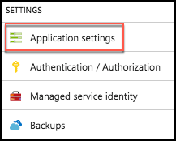

6.  Select the toggle for **Web Sockets** to **On**.

    

7.  Select **Save**.
    
    

8.  You are now ready to provision the other Web App using this same service plan.

9.  Select **+Create a resource, Web + Mobile**, then **Web App**, like you did in Step 2 above.

10. On the Create Web App blade enter the following:

    -   App Name: Provide a **unique name** that is indicative of this resource being used to host the Event Processor WebJob (e.g., chatprocessorwebjob).

    -   Subscription: Select the same subscription used previously.

    -   Resource Group: Select Use existing, and select **the intelligent-analytics** resource group.

    -   OS: Select **Windows**.

    -   App Service plan/Location: Select the **awchatplus** App Service Plan, created above.

11. Select **Create** to provision the Web App. 
    
    

12. When the provisioning completes, navigate to your new Web App in the portal.

13. On the App Service blade, select Application settings.

    

14. Set the **Always On** toggle to the **On** position. You want to make sure Always On is enabled for this so that the Web App hosting the Web Job never goes to sleep, and is always processing chat messages. 

    

15. Select **Save**.
    
    

16. Now, it's time to create an API App.

17. Select **+Create a resource, Web + Mobile, API App**. (Sometimes API App does not appear on the list. If that happens, simply click + New and search for API App.) 

    

18. On the Create API App blade enter the following:

    -   App name: Provide a **unique name** for this API app that reflects it will host the Chat Search API (e.g., ChatSearchApi).

    -   Subscription: Select the same subscription as used previously.

    -   Resource Group: Select the **intelligent-analytics** Resource Group.

    -   App Service plan/Location: Select the **awchatplus** App Service plan.

    -   Select **Create**. 

        

### Task 4: Provision Service Bus 

In this section, you will provision a Service Bus Namespace and Service Bus Topic.

1.  Continuing within the Azure Portal, select +Create a resource.

2.  Select Enterprise Integration, then select Service Bus.

    

3.  On the Create namespace blade enter the following:

    -   Name: Provide a **unique name** for the namespace (e.g., awhotel-namespace).

    -   Pricing tier: Select **Standard**.

    -   Subscription: Select the same subscription as used previously.

    -   Resource Group: Select the **intelligent-analytics** Resource Group.

    -   Location: Select the same Location you have been using.

        

4.  Select **Create**.

5.  Once provisioning completes, navigate to your new Service Bus in the portal by clicking on Resource Groups in the left menu, the selecting intelligent-analytics, and selecting your Service Bus. 

    

6.  On the Overview blade, click on Topic under Entities on the left-hand side of the blade.

    

7.  Add a new Topic by selecting +Topic.
    
    

8.  On the Create topic blade, enter the following:

    -   Name: Enter **awhotel**. This represents that this topic will handle the messages for a particular hotel.

    -   Max topic size: Leave set to **1 GB**.

    -   Message time to live: Set to **1 day**.

    -   Enable partitioning: **Uncheck this checkbox**. Chat will not function properly if this is left checked.

    -   Select **Create**.

        

### Task 5: Provision Event Hubs

In this task, you will create a new Event Hubs namespace and instance.

1.  In the Azure Portal, select **+Create a resource**, then select **Internet of Things**, and select **Event Hubs**.

    

2.  On the Create namespace blade enter the following:

    -   Name: Provide a **unique name** for the namespace (e.g., awhotel-events-namespace).

    -   Pricing tier: Select **Standard**.

    -   Subscription: Select the same subscription as used previously.

    -   Resource Group: Select **the intelligent-analytics** resource group.

    -   Location: Select the **same location** you have been using.

    -   Throughput Units: Leave at **1**

    -   Enable auto-inflate: **uncheck**

    -   Select **Create** to provision the Event Hubs namespace. 

        

3.  When provisioning completes, navigate to your new Event Hub namespace in the portal by clicking on Resource Groups in the left menu. Select intelligent-analytics followed by your Event Hub. 
  
    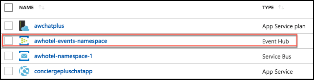

4.  On the Overview blade, click +Event Hub to add a new Event Hub.
    
    

5.  On the Create Event Hub blade, enter the following:

    -   Name: Enter **awchathub**.

    -   Partition Count: Set to the **max value of 32**. This will enable you to significantly scale up the number of downstream processors on the Event Hub, where each partition consumer (as handled by the EventProcessorHost) can reach up to 1 Throughput Unit per partition should the need arise. You cannot change this value later.

    -   Message Retention: **Leave set to 1**.

    -   Capture: Leave set to **Off**.

    -   Leave the remaining values as their defaults.

    -   Select **Create**. 

        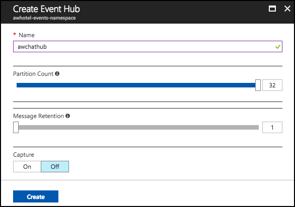

6.  Repeat steps 5a through 5f to create another Event Hub. This one will store messages for archival and be processed by Stream Analytics. Name it awchathub2.

### Task 6: Provision Azure Cosmos DB

In this section, you will provision an Azure Cosmos DB account, a DocumentDB Database, and a DocumentDB collection that will be used to collect all the chat messages.

1.  In the Azure Portal, select +Create a resource, Databases, then select Azure Cosmos DB.

    

2.  On the Azure Cosmos DB blade, enter the following:

    -   ID: Provide a **unique name** for the Azure Cosmos DB account (e.g., awhotelcosmosdb).

    -   API: Select **SQL**.

    -   Subscription: Choose the same subscription you used previously.

    -   Resource Group: Choose the **intelligent-analytics** resource group.

    -   Location: Choose the **same location** you used previously. If the region you've been using isn't available, select a different location for this resource.

    -   Enable geo-redundancy: Ensure this **box is Checked**.

    -   Select awhotelcosmosdb to provision the Azure Cosmos DB instance. 

        

3.  When the provisioning completes, navigate to your new Azure Cosmos DB account in the portal.

4.  Select the Overview blade, then select **+Add Collection**. 

    

5.  On the Add Collection blade, enter the following:

    -   Database id: Enter **awhotels**.

    -   Collection Id: Enter **messagestore**.

    -   Storage Capacity: Select **Fixed (10 GB).**

    -   Throughput: Set to **1000**.

    -   Select OK to add the collection.

        

### Task 7: Provision Azure Search

In this section, you will create an Azure Search instance.

1.  Select **+Create a resource, Web + Mobile**, the select **Azure Search**.

    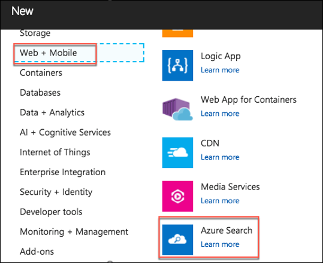

2.  On the New Search Service blade, enter the following:

    -   URL: Provide a **unique name** for the search service (e.g., conciergeplusapp).

    -   Subscription: Choose the subscription used previously

    -   Resource Group: Choose the **intelligent-analytics** resource group.

    -   Location: Choose the location used previously, or the next closest location if your location is unavailable in the list.

    -   Pricing Tier: Select **Basic**.

    -   Select **Create**.

        

### Task 8: Create Stream Analytics job

In this section, you will create the Stream Analytics Job that will be used to read chat messages from the Event Hub and write them to the Azure Cosmos DB.

1.  Select **+Create a resource, Data + Analytics**, the select **Stream Analytics** **job**.

    

2.  On the New Stream Analytics Job blade, enter the following:

    -   Job Name: Enter **MessageLogger**.

    -   Subscription: Choose the same subscription you have been using thus far.

    -   Resource Group: Choose the **intelligent-analytics** Resource Group.

    -   Location: Choose the **same Location** as you have for your other resources.

    -   Hosting environment: Select **Cloud**.

    -   Select **Create** to provision the new Stream Analytics job. 

        

3.  When provisioning completes, navigate to your new Stream Analytics job in the portal by selecting Resource Groups in the left menu, and selecting intelligent-analytics, then selecting your Stream Analytics Job. 

    

4.  Select **Inputs** on the left-hand menu, under Job Topology.
    
    

5.  On the Inputs blade, select **+Add stream input** and then click **Event Hub**.

    

6.  On the New Input blade, enter the following:

    -   Input Alias: Set the value to **eventhub**.

    -   Choose: **Select Event Hub from your subscriptions**

    -   Subscription: Choose the same subscription you have been using thus far.

    -   Event Hub namespace: Choose the Namespace which contains **your Event Hubs instance** (e.g., awhotelevents-namespace).

    -   Event hub name: Choose the second Event Hub instance you created (**awchathub2**).

    -   Service bus namespace:

    -   Event hub policy name: Leave as **RootManageSharedAccessKey.**

    -   Event hub consumer group: Leave this **blank** (\$Default consumer group will be used).

    -   Event serialization format: Leave as **JSON**.

    -   Encoding: Leave as **UTF-8**.

    -   Event compression type: Leave set to **None**.

    -   Select **Save**.

        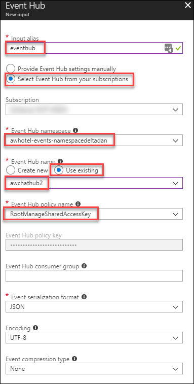

7.  Now, select **Outputs** from the left-hand menu, under Job Topology.

    

8.  In the Outputs blade, click **+Add**, then click **Cosmos DB.**

    

9.  On the Cosmos DB New output blade, enter the following:

    -   Output alias: Enter **cosmosdb**.

    -   Import Option: Leave set to Select Cosmos DB from your subscriptions.

    -   Subscription: Choose the same subscription you have been using thus far.

    -   Account Id: Select your Account id (e.g., awhotel-cosmosdb).

    -   Database: Select your database, **awhotels**.

    -   Collection name pattern: Set to the name of your single collection, **messagestore**.

    -   Document Id: Set to **messageid** (all lowercase).

    -   Select **Save**.

        

10. Create another Output, this time for Power BI.

    

11. On the New output blade, enter the following:

    -   Output alias: Enter **powerbi**

    -   Group workspace: **Authorize connection to load workspaces**.

    -   Dataset Name: Set to **Messages**

    -   Table Name: Set to **Messages**

    -   Select **Authorize**. This will authorize the connection to your Power BI account. When prompted in the popup window, enter the account credentials you used to create your Power BI account in [Before the Hands-on Lab, Task 1](#task-1-provision-power-bi). You may have to enter your Username and Password.

        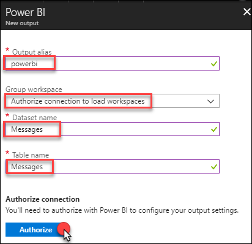

12. Select **Save**.

13. Next, select Query from the left-hand menu, under Job Topology.

    

14. In the query text box, enter the following query for Cosmos DB:
    ```
    SELECT
    *
    INTO
    cosmosdb
    FROM
    eventhub
    ```

15. Select Save, and Yes when prompted with the confirmation.

    

16. Now, modify your query to add the following Power BI query. Enter or paste the following code below the first query:
    ```
    SELECT
    *
    INTO
    powerbi
    FROM
    eventhub
    ```

17. Your query text should now look like the following: 

    

18. Select Save again, and select Yes when prompted with the confirmation.
    
    

### Task 9: Start the Stream Analytics Job

1.  Navigate to your Stream Analytics job in the portal by selecting Resource Groups in the left menu, and selecting intelligent-analytics, then selecting your Stream Analytics Job. 

    

2.  From the Overview blade, select **Start**.
    
    

3.  In the Start job blade, select **Now** (the job will start processing messages from the current point in time onward).

    

4.  Select **Start**.

5.  Allow your Stream Analytics Job a few minutes to start. Once the Job starts it will move to a state of Running.

    

### Task 10: Provision an Azure Storage Account

The EventProcessorHost requires an Azure Storage Account that it will use to manage its state among multiple instances. In this section, you create that Storage Account.

1.  Using the Azure Portal, select **+Create a resource, Storage, the select Storage account -- blob, file, table, queue.**

    

2.  In the Create storage account blade, enter the following:

    -   Name: Provide a **unique name** for the account (e.g., awhotelchatstore).

    -   Deployment model: Leave **Resource Manager** selected.

    -   Account kind: Leave **General purpose** selected.

    -   Performance: Set to **Standard**.

    -   Replication: Set to **Locally Redundant Storage (LRS)**.

    -   Secure transfer required: Select **Disabled**.

    -   Subscription: Choose the Subscription used previously.

    -   Resource Group: Choose the **intelligent-analytics** resource group.

    -   Location: Choose the location used previously.

    -   Configure virtual networks: Leave set to **Disabled**.

    -   Select **Create**.

        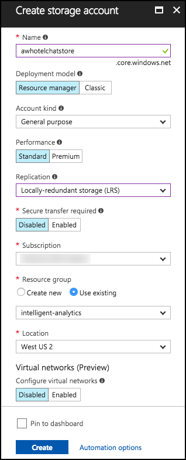

### Task 11: Provision Cognitive Services

To provision access to the Text Analytics API (which provides sentiment analysis features), you will need to provision a Cognitive Services account.

1.  In the Azure Portal, select +Create a resource, then AI + Cognitive Services, Text Analytics API.

    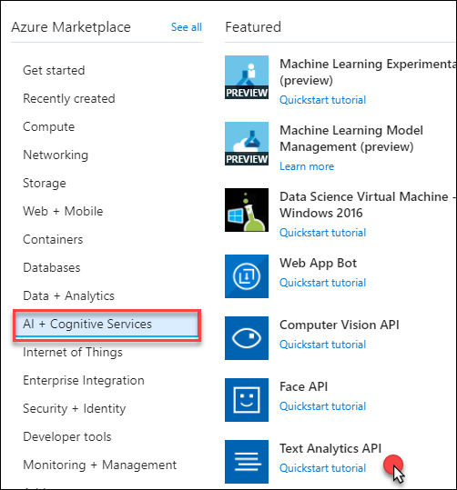

2.  On the Create blade, enter the following:

    -   Name: Enter **awhotels-sentiment**.

    -   Subscription: Choose the subscription used previously.

    -   Location: Select the location you used previously.

    -   Pricing tier: Choose **F0**

    -   Resource group: Choose the **intelligent-analytics** resource group.

    -   Check the box to confirm you have read and understood the notice.

        

3.  Select **Create**.

4.  When it finishes provisioning, browse to the newly created cognitive service by selecting Resource Groups in the left menu, then select the **intelligent-analytics** resource group, and selecting the Cognitive Service, **awhotels-sentiment**.

5.  Acquire the key for the API by selecting Keys on the left-hand menu.

    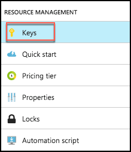

6.  Copy the value for Key 1, and paste it into a text editor, such as Notepad, for later reference in the ConciergePlusSentiment solution in Visual Studio. 

    

7.  Repeat steps 1-7, this time selecting Bing Speech API.

    -   Enter the name speech-api.

    -   Take note of Key 1 for Speech.

        

8.  Repeat steps 1-7, this time selecting Language Understanding Intelligent Service (LUIS) for the API Type on the Create blade.

    -   Enter the name **luis-api.**

    -   Take note of Key 1 for LUIS.

        

9.  Verify that you have captured all three of the API keys for later reference in this lab.

    

## Exercise 2: Implement message forwarding

Duration: 45 minutes

In this section, you will implement the message forwarding from the ingest Event Hub instance to an Event Hub instance and a Service Bus Topic. You will also configure the web-based components, which consist of three parts: The Web App UI, a Web Job that runs the EventProcessorHost, and the API App that provides a wrapper around the Search API.

### Task 1: Implement the event processor

1.  On your Lab VM, open the ConciergePlusSentiment.sln file that you downloaded using Visual Studio, if it is not already open.

2.  Open **SentimentEventProcessor.cs** (found within the **ChatMessageSentimentProcessor** project in the Solution Explorer).

    

3.  Scroll down to the IEventProcessor.ProcessEventsAsync method. This method represents the heart of the message processing logic utilized by the Event Processor Host running in a Web Job. It is provided a collection of EventData instances, each of which represent a chat message in the solution. 

    

4.  Locate TODO: 1 and replace the lines that follow the comment with the following:
    ```
    //TODO: 1.Extract the JSON payload from the binary message
    var eventBytes = eventData.GetBytes();
    var jsonMessage = Encoding.UTF8.GetString(eventBytes);
    Console.WriteLine("Message Received. Partition '{0}', SessionID '{1}' Data '{2}'", context.Lease.PartitionId, eventData.Properties["SessionId"], jsonMessage);
    ```

5.  Locate TODO: 2 and replace the line that follows with:
    ```
    //TODO: 2.Deserialize the JSON message payload into an instance of MessageType
    var msgObj = JsonConvert.DeserializeObject<MessageType>(jsonMessage);
    ```

6.  Locate TODO: 3 and replace the line that follows with:
    ```
    //TODO: 3. Create a BrokeredMessage (for Service Bus) and EventData instance (for EventHubs) from source message body
    var updatedEventBytes = Encoding.UTF8.GetBytes(JsonConvert.SerializeObject(msgObj));
    BrokeredMessage chatMessage = new BrokeredMessage(updatedEventBytes);
    EventData updatedEventData = new EventData(updatedEventBytes);
    ```

7.  Locate TODO: 4 and replace the lines that follow with:
    ```
    //TODO: 4.Copy the message properties from source to the outgoing message instances
    foreach (var prop in eventData.Properties)
    {
    chatMessage.Properties.Add(prop.Key, prop.Value);
    updatedEventData.Properties.Add(prop.Key, prop.Value);
    }
    ```

8.  Locate TODO: 5 and replace the line that follows with:
    ```
    //TODO: 5.Send chat message to Topic
    _topicClient.Send(chatMessage);
    Console.WriteLine("Forwarded message to topic.");
    ```

9.  Locate TODO: 6 and replace the line that follows with:
    ```
    //TODO: 6.Send chat message to next EventHub (for archival)
    _eventHubClient.Send(updatedEventData);
    Console.WriteLine("Forwarded message to event hub.");
    ```

10. Save the file, but clicking the Save button on the Visual Studio toolbar. 

    

### Task 2: Configure the Chat Message Processor Web Job

1.  Within Visual Studio Solution Explorer, expand the **ChatMessageSentimentProcessor** project, and open **App.Config**.

    

2.  You will update the appSettings in this file. The following sections walk you through the process of retrieving the values for the following settings:
    ```
      <add key="eventHubConnectionString" value="" />
      <add key="sourceEventHubName" value="" />
      <add key="destinationEventHubName" value="" />
      <add key="storageAccountName" value="" />
      <add key="storageAccountKey" value="" />
      <add key="serviceBusConnectionString" value="" />
      <add key="chatTopicPath" value="" /> 
      <add key="textAnalyticsAccountName" value="" />
      <add key="textAnalyticsAccountKey" value="" />
    ```

#### Event Hub connection string 

The connection string required by the ChatMessageSentimentProcessor is different from the typical Event Hub consumer, because not only does it need Listen permissions, but it also needs Send and Manage permissions on the Service Bus Namespace (because it receives messages, as well as creates Subscriptions).

1.  To get the eventHubConnectionString, navigate to the Event Hub namespace in the Azure Portal by selecting Resource Groups on the left menu, then selecting the intelligent-analytics resource group, and selecting your Event Hub from the list of resources. 

    

2.  Select Shared access policies, under Settings, within the left-hand menu.

3.  In the Shared access policies, you are going to create a new policy that the ChatConsole can use to retrieve messages. Click **+Add**. 

    

4.  For the New Policy Name, enter ChatConsole.

5.  In the list of Claims, select Manage. Send and Listen will be automatically selected when you select Manage.

    

6.  After the **ChatConsole** shared access policy is created, select it from the list of policies, and then copy the Connection string--primary key value. 

    

7.  Return to the **app.config** file in Visual Studio, and paste this as the **value** for **eventHubConnectionString**.

#### Event Hub name

Your event hubs can be found by going to your Event Hub overview blade, and selecting Event Hubs from the left menu.


1.  For the **sourceEventHubName** setting in **app.config**, enter the name of your first Event Hub, **awchathub**.

2.  For the **destinationEventHubName**, enter the name of your second Event Hub, **awchathub2**.

#### Storage account

Your storage accounts can be found by going to the intelligent-analytics resource group, and selecting the Storage account.

1.  For the **storageAccountName** enter the name of the storage account you created.

2.  For the **storageAccountKey** enter the Key for the storage account you created (which you can retrieve from the Portal).

    -   From your storage account's blade, select Access Keys from the left menu, under Settings.

        

    -   Copy the Key value for key1, and paste that into the value for storageAccountKey in the App.Config file. 
        

#### Service Bus connection String 

The namespace, and therefore connection string, for the service bus is different from the one for the event hub. As we did for the event hub, we need to create a shared access policy to allow the ChatMessageSentimentProcessor Manage, Send, and Listen permissions.

1.  To get the **serviceBusConnectionString**, navigate to the **Service Bus namespace** in the Azure Portal.

2.  Select **Shared access policies** within the left menu, under Settings.

    

3.  In the Shared access policies, you are going to create a new policy that the ChatConsole can use to retrieve messages. Click +Add.

    

4.  For the New Policy Name, enter ChatConsole.

5.  In the list of Claims, select Manage, Send, and Listen.
    
    

6.  Select Create.
    
    

7.  After the **ChatConsole** shared access policy is created, select it from the list of policies andcopy the Primary Connection String value.

    

8.  Return to the **app.config** and paste this as the value for **serviceBusConnectionString**.

#### Chat topic 

1.  For the **chatTopicPath**, enter the name of the Service Bus Topic you had created (e.g., awhotel). This can be found under Topics on the Service Bus overview blade.

    

#### Text Analytics API settings

1.  Using the Azure Portal, open the Text API (awhotels-sentiment), copy the value under Endpoint into the **textAnalyticsBaseUrl** setting. Be sure to include a trailing slash in the URL (e.g. <https://westus.api.cognitive.microsoft.com/text/analytics/v2.0/)>. 

    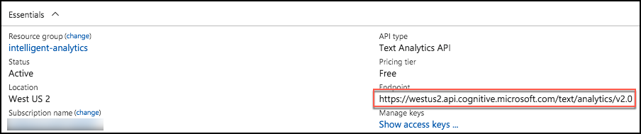

2.  On the left-hand menu of the Text APInt blade, select Keys. 

    

3.  Copy the value of **Account Name** into the value attribute of **textAnalyticsAccountName** in the **app.config**.

4.  Copy the value of **Key 1** from the blade into the value attribute of the **textAnalyticsAccountKey** in the **app.config**.

5.  Save the app.config file. It should now resemble the following:

    

## Exercise 3: Configure the Chat Web App settings

Duration: 10 minutes

Within Visual Studio Solution Explorer, expand the **ChatWebApp** project and open **Web.Config**. You will update the in this file. The following sections walk you through the process of retrieving the values for the following settings:
    ```
    <add key="eventHubConnectionString" value=" "/>
    <add key="eventHubName" value=" "/>
    <add key="serviceBusConnectionString" value=" "/>
    <add key="chatRequestTopicPath" value=" "/>
    <add key="chatTopicPath" value=" "/>
    ```

### Task 1: Event Hub connection String 

1.  Use the same connection string you used for the **eventHubConnectionString** in the **App.Config** file of the **ChatMessageSentimentProcess** Web Job project.

### Task 2: Event Hub name

1.  For the **eventHubName** setting in **Web.config**, enter the name of your first Event Hub (**awchathub**). This event Hub will receive messages from the website chat clients.

### Task 3: Service Bus connection String 

1.  Use the same connection string you used for the **serviceBusConnectionString** in the **app.Config** file of the **ChatMessageSentimentProcess** Web Job project.

### Task 4: Chat topic path and chat request topic path

1.  For the **chatRequestTopicPath** and the **chatTopicPath**, enter the name of the Service Bus Topic you created, **awhotel**. The value is the same for both settings in this case.

2.  The **web.config** should resemble the following. Click Save in Visual Studio.

    

## Exercise 4: Deploying the App Services

Duration: 15 minutes

With the App Services projects properly configured, you are now ready to deploy them to their pre-created services in Azure.

### Task 1: Publish the ChatMessageSentimentProcessor Web Job

1.  Within Visual Studio Solution Explorer, right-click the **ChatMessageSentimentProcessor** project in the Solution Explorer, and select **Publish as Azure Web Job**.

    

2.  In the Publish dialog, select Microsoft Azure App Service as the publish target.
    
    

3.  In the App Service dialog, choose the Subscription that contains your Web Job Web App you provisioned earlier. Expand your Resource Group (e.g., **intelligent-analytics**), then select the node for your Web Job Web App in the tree view to select it. 

    

4.  Select **OK**.

5.  Select Publish. 

    

6.  When the publish completes, the Output window should indicate success similar to the following:
    
    
    
**Note**: If you receive an error in the Output window, as a result of the publish process failing (The target \"MSDeployPublish\" does not exist in the project), you need to update the Microsoft.Web.WebJobs.Publish NuGet package. To do this, click on Tools NuGet Package Manager Package Manager Console.
    


7.  In the Package Manager Console, type the following and hit Enter:
    ```
    Update-Package Microsoft.Web.WebJobs.Publish -Reinstall
    ```

**Note**: If prompted to replace a Swagger file, enter N, and press Enter.

8.  Repeat steps 1-5 to publish.

### Task 2: Publish the ChatWebApp

1.  Within Visual Studio Solution Explorer, right-click the ChatWebApp project and select Publish.
    
    

2.  In the Publish document, select **Microsoft Azure App Service**, and choose the **Select** existing radio button. Select **Publish**.
    
    \
    
    You may see a different dialog than what is shown above. If so, select Microsoft Azure App Service:
    
    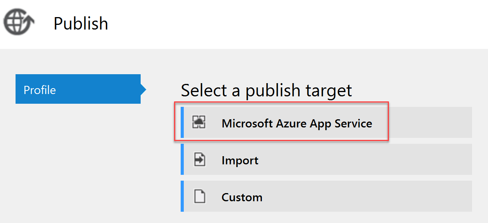

3.  In the App Service dialog, choose your Subscription that contains your Web App you provisioned earlier. Expand your Resource Group (e.g., **intelligent-analytics**), then select the node for your **Web App** in the tree view to select it.

    

4.  Select **OK**.

5.  When the publishing is complete, a browser window should appear with content like the following.
    
    

### Task 3: Testing hotel lobby chat

1.  Open a browser instance (Chrome is recommended for this web app), and navigate to the deployment URL for your Web App.

    -   If you are unsure what this URL is, it can be found in two places:

        i.  First, you can find it on the ChatWebApp document in Visual Studio, that was opened when you published the Web App. 

        ii. Alternatively, this can be found in the Azure Portal on the Overview blade for your Web App 

2.  Under the Join Chat area, enter your username (anything will do).

3.  Leave Hotel Lobby selected.

1.  Select **Join**.
    
    

5.  The Live Chat should appear. (Notice it auto-announced you joining to the room; this is the first message. Note, this may take a few seconds to appear.)

    

6.  Open another browser instance. (You could try this from your mobile device.)

7.  Enter another username, and Select Join.

8.  From either session, fill in the Chat text box and select Send. You can try using @ and \# too, just to seed some text for search.

    

9.  You can join with as many sessions as you want. (The Hotel Lobby is basically a public chat room.)

## Exercise 5: Add intelligence

Duration: 60 minutes

In this exercise, you will implement code to activate multiple cognitive intelligence services that act on the chat messages.

### Task 1: Implement sentiment analysis

In this task, you will add code that enables the Event Processor to invoke the Text Analytics API using the REST API and retrieve a sentiment score (a value between 0.0, negative, and 1.0, positive sentiment) for the text of a chat message.

1.  In the Solution Explorer in Visual Studio, open **SentimentEventProcessor.cs** in **ChatMessageSentimentProcessor** project.

2.  Scroll down to the method **GetSentimentScore**.

3.  Replace the code following TODO: 7 with the following:
    ```
    //TODO: 7.Configure the HTTPClient base URL and request headers
    client.BaseAddress = new Uri(_textAnalyticsBaseUrl);
    client.DefaultRequestHeaders.Add("Ocp-Apim-Subscription-Key", _textAnalyticsAccountKey);
    client.DefaultRequestHeaders.Accept.Add(new MediaTypeWithQualityHeaderValue("application/json"));
    ```

4.  Replace the code following TODO: 8 with the following:
    ```
    //TODO: 8.Construct a sentiment request object
    var req = new SentimentRequest()
    {
    documents = new SentimentDocument[]
    {
    new SentimentDocument() { id = "1", text = messageText }
    }
    };
    ```

5.  Replace the code following TODO: 9 with the following:
    ```
    //TODO: 9.Serialize the request object to a JSON encoded in a byte array
    var jsonReq = JsonConvert.SerializeObject(req);
    byte[] byteData = Encoding.UTF8.GetBytes(jsonReq);
    ```

6.  Replace the code following TODO: 10 with the following:
    ```
    //TODO: 10.Post the rquest to the /sentiment endpoint
    string uri = "sentiment";
    string jsonResponse = "";
    using (var content = new ByteArrayContent(byteData))
    {
    content.Headers.ContentType = new MediaTypeHeaderValue("application/json");
    var sentimentResponse = await client.PostAsync(uri, content);
    jsonResponse = await sentimentResponse.Content.ReadAsStringAsync();
    }
    Console.WriteLine("\nDetect sentiment response:\n" + jsonResponse);
    ```

7.  Replace the code following TODO: 11 with the following:
    ```
    //TODO: 11.Deserialize sentiment response and extract the score
    var result = JsonConvert.DeserializeObject<SentimentResponse>(jsonResponse);
    sentimentScore = result.documents[0].score;
    ```

8.  Finally, navigate to the IEventProcessor.ProcessEventsAsync and replace the line following TODO: 12 with the following code:
    ```
    //TODO: 12 Append sentiment score to chat message object
    msgObj.score = await GetSentimentScore(msgObj.message);
    ```

9.  Save the file.

### Task 2: Implement linguistic understanding

In this task, you will create a LUIS app, publish it, and then enable the Event Processor to invoke LUIS using the REST API.

1.  Using a browser, navigate to <http://www.luis.ai>.

2.  Select **Sign in** **or create an account**. 

    

3.  Sign in using your Microsoft account (or \@Microsoft.com account if that is appropriate to you). The new account startup process may take a few minutes.

4.  Click **Accept**.

    

5.  You should be redirected to the LUIS Welcome page at <https://www.luis.ai/welcome>. Scroll down and click **Create LUIS app.**

    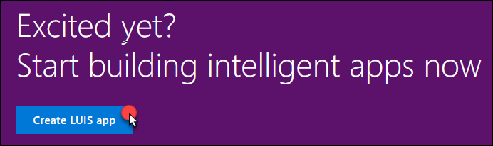

6.  Complete the additional info and terms of use form and select **Continue**.
    
    

7.  Under My Apps, select **Create New App**.

8.  Complete the Create a new app form by providing a name for your LUIS app, the culture and select **Done**.

    

9.  In a moment, your new app will appear. Click the app to see the details.

10. In the menu bar, select **Publish**, select the appropriate region, and select Add Key.

    

11. In the Assign a key to your app dialog, select your Tenant name and Subscription, and then select the luis-api key from the list.

    

12. Select **Add Key**.

13. Select My Apps from the menu bar and choose your app from the list.

14. Select **Intents** on the left-hand menu, then **Create new intent**.

    

15. In the Intents dialog, for the Intent Name enter **OrderIn** and select **Done**.
    
    

16. In the Utterances text box, enter "order a pizza". Press Enter to add the utterance.
    
    

17. Select Entities from the menu on the left.
    
    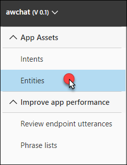

18. Select Create new entity.

    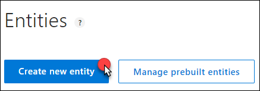

19. For the Entity name specify "**RoomService**" and set the Entity Type to **Hierarchical**.
    
    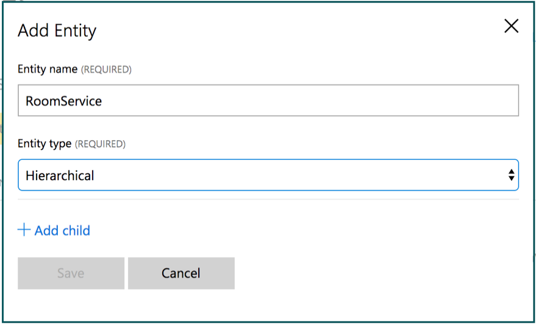

20. Select **+ Add child entity**.

21. For Child Name provide a name of **FoodItem**.
    
    

22. Select +Add a child entity and provide a name of **RoomItem**. Select **Done**.

    

23. Select **Intents** from the menu on the left and select the **OrderIn** intent you created.

24. In the utterance, select the word pizza so it becomes highlighted.

    ![In the Utterances (1) section, order a \[pizza\] is selected, and below that, RoomService displays with a chevron next to it.](images/Hands-onlabstep-by-step-Intelligentanalyticsimages/media/image125.png "Utterances order a pizza")

25. Under Entities select **RoomService**, then select **FoodItem**.

    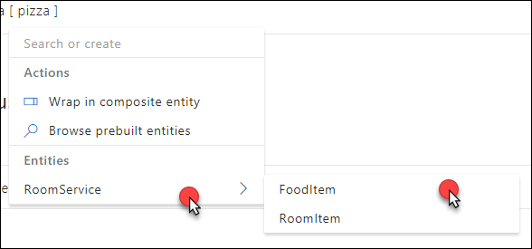

26. In the Type a new utterance text box, enter the following utterance:

    -   Utterance: **bring me toothpaste**

    -   Text to select: **toothpaste**

    -   Drop-down: **OrderIn**

    -   Entity: **RoomService:RoomItem**

27. Repeat this process for the following phrases (text to select is in bold):

    -   **Bring me towels \| RoomService:RoomItem**

    -   **Bring me blankets \| RoomService:RoomItem**

    -   **Order a soda \| RoomService:FoodItem**

    -   **Order me a hamburger \| RoomService:FoodItem**

        

28. Select Train from the menu bar.

    

29. Click Test and experiment with the by writing some utterances and pressing enter to see the interpretation.
    
    

30. Select Publish App from the menu on the top. Then select the proper Timezone, and select Publish to production slot.

    

31. When the publish completes, click the URL displayed next to the **luis-api** key at the bottom of the Publish App screen.

    

32. This will open a new tab in your browser. Modify the end of the URL (the text following q= ) so it contains the phrase "order a pizza," and press ENTER. You should receive output similar to the following. Observe that it correctly identified the intent as OrderIn (in this case with a confidence of 0.9999995 or nearly 100%) and the entity as pizza having an entity type of RoomService::FoodItem (in this case with a confidence score of 96.1%)
    
    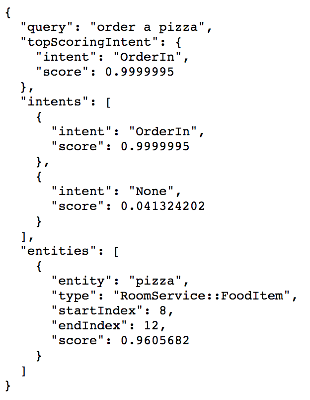

33. In the URL, take note of two things:

    -   The base URL, *highlighted in green*. Copy this value, and paste it into a text editor, such as Notepad, for later reference.

    -   The GUID following apps/GUID/, *highlighted in yellow*. This is your App ID and you will need to use it in configuration later, it looks like the following:
        https://westus.api.cognitive.microsoft.com/luis/v2.0/apps/e49117d8-0275-4319-8fed-698ff6dc8192?subscription-key=08a82755f5f040ae9b4376ccab5fa6bc&verbose=true&timezoneOffset=-300&q=

34. You can add more utterances as desired by repeating the above steps to add new utterances, indicate the entity, train the model, and then update the publish application using the button in the Publish App screen.

35. When you are ready to integrate LUIS into your app, go to the Publish App screen, and locate the luis-api key under Resources and Keys. Copy the first Key String for luis-api. Copy this to your notepad.

    

**Note**: This is the same key you can obtain on the Keys blade for the luis-api Cognitive Service in the Azure portal.

36. You will enter this into the configuration of the Event Processor.

37. In Visual Studio, open the **App.config** for the **ChatMessageSentimentProcessor** project.

38. Within the appSettings section, for the key **luisAppId** set the text of the value attribute to the App ID of your LUIS App (this value should be a GUID you obtained from the URL and not the name of your LUIS app). For the key **luisKey**, set the text of the value attribute to the Endpoint key used by your LUIS app (as you acquired it from the Azure Portal).
    
    

39. Save the **app.config**. The Event Processor is pre-configured to invoke the LUIS API using the provided App ID and key.

40. Open SentimentEventProcessor.cs and navigate to IEventProcessor.ProcessEventsAsync.

41. Locate TODO: 13 and replace it with the following:
    ```
    //TODO: 13.Respond to chat message intent if appropriate
    var intent = await GetIntentAndEntities(msgObj.message);
    HandleIntent(intent, msgObj);
    ```

42. At the top of the file, locate the variable named \_luisBaseUrl. 

    

43. You will replace the value of this variable with the base URL you copied from the LUIS site above (the part highlighted in green).

44. Take a look at the implementation of both methods if you are curious how the entity and intent information is used to generate an automatic chat message response from a bot.

45. Save the file.

### Task 3: Implement speech to text

There is one last intelligence service to activate in the application---speech recognition. This is powered by the Bing Speech API, and is invoked directly from the web page without going through the web server. In the steps that follow, you insert your Cognitive Services Speech API key into the configuration to enable speech to text.

1.  Within Visual Studio Solution Explorer, expand **ChatWebApp**, **Scripts**, and open **chatClient.js**.

2.  At the top, locate the variable **speechApiKey**, and update its value with the Key 1 you acquired in [Exercise 1, Task 11, Step 8](#task-11-provision-cognitive-services), when you provisioned your Speech API in the Azure Portal.
    
    

3.  Save chatClient.js.

**Note**: Embedding the API Key as shown here is done only for convenience. In a production app, you will want to maintain your API Key server-side.

### Task 4: Re-deploy and test

Now that you have added sentiment analysis, language understanding, and speech recognition to the solution, you need to re-deploy the apps so you can test out the new functionality.

1.  Publish the **ChatMessageSentimentProcessor** Web Job using Visual Studio just as you did in [Exercise 4, Task 1](#task-1-publish-the-chatmessagesentimentprocessor-web-job).

2.  Publish the **ChatWebApp** just as you did in [Exercise 4, Task 2](#task-2-publish-the-chatwebapp).

3.  When both have published, navigate to your deployed web app making sure to use HTTPS. (This is required for most browsers to support the microphone needed for speech recognition.)

4.  Join a chat with the Hotel Lobby.

5.  Type a message with a positive sentiment, like "I love this weather." Observe the "thumbs-up" icon that appears next to the chat message you sent. Next, types something like, "This weather is terrible," and observe the thumbs-down icon. These are indicators of sentiment (as applied by your solution in real-time). \`\`

    

6.  Next, try ordering some items from room service, like "bring me towels" and "order a pizza." Observe that you get a response from the ConciergeBot, and that the reply indicates whether your request was sent to Housekeeping or Room Service, depending on whether the item ordered was a room or food item. 

    

7.  Finally, instead of typing your text, select the microphone to the left of the text box and speak for 2 to 3 seconds. Your spoken message should appear. Select the paper airplane icon to send it. 

    

## Exercise 6: Building the Power BI dashboard

Duration: 30 minutes

Now that you have the solution deployed and exchanging messages, you can build a Power BI dashboard that monitors the sentiments of the messages being exchanged in real time. The following steps walk through the creation of the dashboard.

### Task 1: Create the static dashboard

1.  Sign in to your Power BI subscription (<https://app.powerbi.com>).

2.  Select My Workspace on the left-hand menu, the select the Datasets tab. 

    

3.  Under the **Datasets** list, select the **Messages** dataset. Search for the Messages dataset, if there a too many items in the dataset list. 

    

4.  Select the **Create Report** button under the Actions column. 

    

5.  On the Visualizations palette, select **Gauge** to create a semi-circular gauge.
    
    

6.  In the Fields listing, select and drag the **score** field and drop it onto the **Value** field.
    
    

7.  Select the drop-down menu that appears where you dropped score and select **Average**.
    
    

8.  You now should have a gauge that shows the average sentiment for all the data collected so far, which should look similar to the following:
    
    

9.  From the File menu, select Save to save your visualization to a new report.

    

10. Enter **ChatSentiment** for the report name, and select **Save**. 

    

### Task 2: Create the real-time dashboard

This gauge is currently a static visualization. You will use the report just created to seed a dashboard whose visualizations update as new messages arrive.

1.  Select the Pin Live Page icon located near the top right of the Gauge control. 

    

2.  Select New **dashboard**, enter **Real-time Sentiment** as the name, and select Pin Live. 

    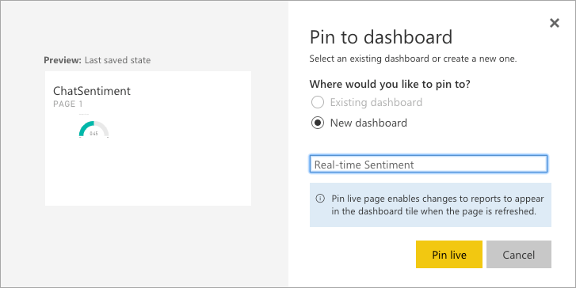

3.  Return to the **My Workspace** page, and select your newly created dashboard from the list of dashboards. 

    

4.  Real-time dashboards are created in Power BI using the Q&A feature, by typing in a question to visualize in the space provided. In the "Ask a question about your data" field, enter: "average score created between yesterday and today".
    
    

5.  Next, convert this to a Gauge chart by expanding the Visualizations palette at right, and selecting the Gauge control.

    

6.  Format the Gauge control so it ranges between 0.0 and 1.0 and has an indicator at 0.5. To do this, select the brush icon in the Visualization palette, expand the Gauge axis, and for Min enter 0, Max enter 1, and Target enter 0.5. 

    

7.  Your gauge should now look similar to the following:
    
    

8.  In the top-right corner, select **Pin visual.**
    
    

9.  In the dialog that appears, select the dashboard you recently created and select **Pin**. 

    

10. In the list of dashboards, select your Real-time Sentiment dashboard. Your new gauge should appear next to your original gauge. If the original gauge fills the whole screen, you may need to scroll down to see the new gauge. You can delete the original gauge if you prefer. (Select the top of the visualization, then ellipses that appear, and the, the trash can icon.)
    
    

11. Navigate to the chat website you deployed and send some messages and observe how the sentiment gauge updates with moments of you sending chat messages.

12. Try building out the rest of the real-time dashboard that should look as follows. We provide the following Q&A questions you can use to get started.
    
    

    -   Count of Messages (Card visualization): count of messages between yesterday and today

    -   Count of Messages by Username (Pie chart visualization): count of messages by username between yesterday and today

    -   Upset Users (Bar chart visualization): Average score by username between yesterday and today

13. Invite some peers to chat and monitor the sentiments using your new, real-time dashboard.

## Exercise 7: Enabling search indexing

Duration: 30 minutes

Now that you have primed the system with some messages, you will create a Search Index and an Indexer in Azure Search upon the messages that are collected in Azure Cosmos DB.

### Task 1: Verifying message archival

Before going further, a good thing to check is whether messages are being written to Azure Cosmos DB from the Stream Analytics Job.

1.  In the Azure Portal, navigate to your **Azure Cosmos DB account**.

2.  On the left-hand menu, select **Data Explorer**.
    
    

3.  Under the **awhotels** Cosmos DB, click **messagestore**, then Documents. You should see some data here.

    

4.  If you want to peek at the message contents, select any document in the listing.
    

### Task 2: Creating the index and indexer

1.  Select Resource Groups from the left menu, then select the **intelligent-analytics** resource group.

2.  Select your **Search** **service** instance from the list.

3.  Select **Import data**.

    

4.  On the Import data blade, select **Connect to your data**.

    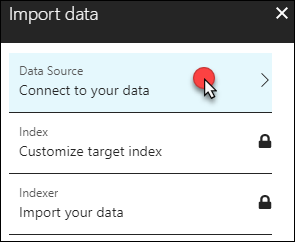

5.  On the Data Source blade, select **Cosmos DB**.

    

6.  Enter **messagestore** for the name of the data source.

    

7.  Select your **Cosmos DB** account.

8.  Choose your **awhotels** database.

9.  Choose your **messagestore** collection.

10. Select **OK** to complete the Data Source configuration.

11. Select **Customize target index**, and observe that the field list has been pre-populated for you based on data in the collection.

12. Enter **chatmessages** for the name of the index.

13. Leave the Key set to id.
    
    

14. Select the Retrievable check box for the following fields: **message, createDate**, **and username** (id will be selected automatically). Only these fields will be returned in query results.

15. Select the Filterable check box for **createDate, username**, **and sessionId**. These fields can be used with the filter clause only (not used by this Tutorial, but useful to have).

16. Select the Sortable check box for **createDate**, **username**, and **sessionId**. These fields can be used to sort the results of a query.

17. Select the Searchable check box for message. Only these fields are indexed for full text search.

18. Confirm your grid looks similar to the following, and select OK. 

    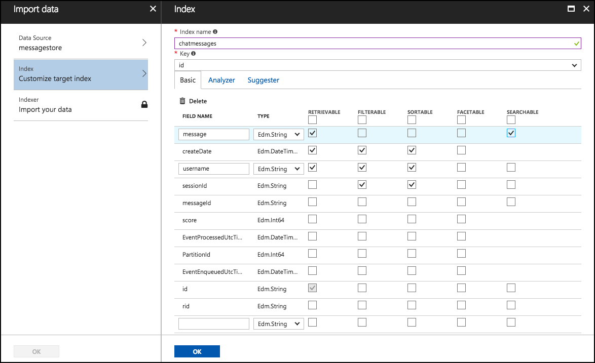

19. Select **Import your data**.
    
    

20. On the Create an Indexer blade, enter **messages-indexer** as the name.

21. Set the Schedule toggle to **Custom**.

22. Enter an interval of **5** minutes (the minimum allowed).

23. Set the Start time to **today's date**.

24. The description and other fields can be ignored.

25. Select **OK**. 
    
    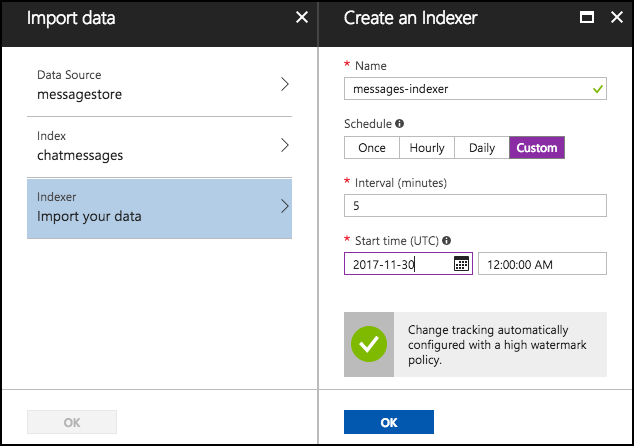

26. Select **OK** once more to begin importing data using your indexer.

27. After a few moments, examine the Indexers tile for the status of the Indexer.
    
    

### Task 3: Update the Web App web.config

1.  On your Lab VM, within Visual Studio Solution Explorer, expand the **ChatWebApp** project.

2.  Open **Web.config**.

3.  For the **chatSearchApiBase**, enter the URI of the Search API App (e.g., <http://awchatsearch.azurewebsites.net)>. This value should not be the URL to your instance of Azure Search.

    -   You can find this by going to Resource Groups, selecting the **intelligent-analytics** resource group, and selecting your search app service from the list. 
        
        

    -   On the Essentials blade for your service, you will find the URL value. 

        

4.  Copy the URL value, and paste it into the value setting for the **chatSearchApiBase** key. 

    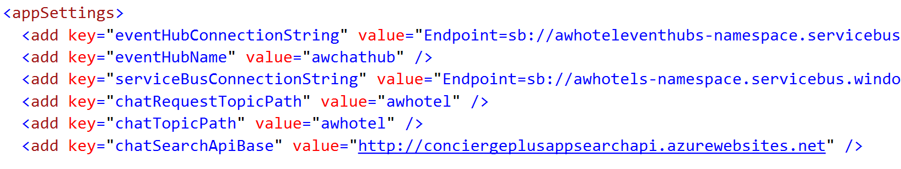

5.  Save **Web.config**.

### Task 4: Configure the Search API App

1.  Within Visual Studio Solution Explorer, expand the **ChatAPI** project.

2.  Open **web.config**.

3.  This project needs the following three settings configured to capitalize on Azure Search, all of which you can get from the Azure Portal.
    
    

4.  Using the Azure Portal, navigate to the blade of your **Search** service.

5.  For the **SearchServiceName**, enter the name of your Search service (e.g., **awchatter**).

6.  For the **SearchServiceQueryApiKey**, do the following:

    -   On the Search service blade, select Keys on the left-hand menu.

        

    -   Select **Manage query keys**. 

        

    -   On the Manage query keys blade, copy the \<empty\> key value. 
       
        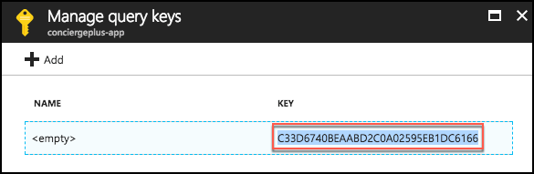

    -   Copy this value into the **SearchServiceQueryApiKey** setting.

7.  For the **SearchIndexName** setting, enter the name of the Index you created in Search, chatmessages.

8.  Save **Web.config**.

### Task 5: Re-publish apps

1.  Publish the updated **ChatWebApp** using Visual Studio, as was shown previously in [Exercise 4, Task 2](#task-2-publish-the-chatwebapp).

2.  Within Visual Studio Solution Explorer, right-click the **ChatAPI** project and select **Publish**.
    
    

3.  Select Microsoft Azure App Service, choose the Select **existing** radio button and select **Publish**.

4.  If prompted, sign in with your credentials to your Azure Subscription.

5.  In the App Service dialog, choose your Subscription that contains your API App you provisioned earlier. Expand your Resource Group (e.g., **intelligent-analytics**), then select the node for your API App in the tree view to select it.

    

6.  Select **OK**.

7.  When the publishing is complete, a browser window should appear with content similar to the following.
    
    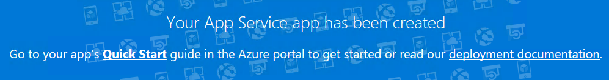

8.  Navigate to the Search tab on the deployed Web App and try searching for chat messages. (Note that there is up to a 5-minute latency before new messages may appear in the search results.

    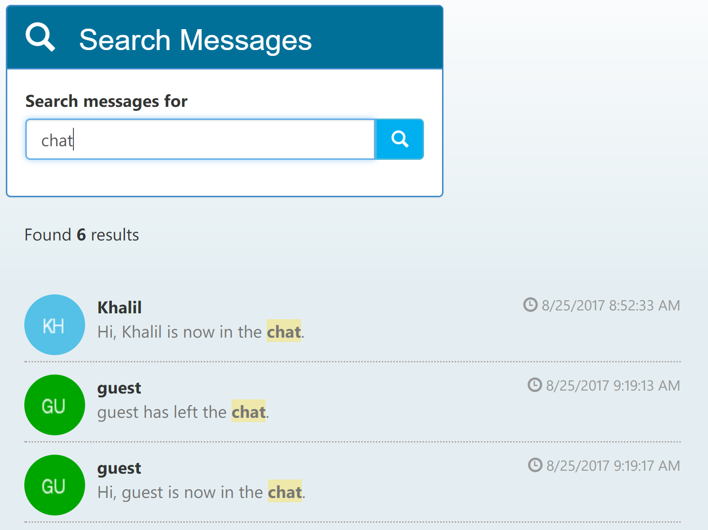

## After the hands-on lab 

Duration: 10 minutes

In this exercise, attendees will deprovision any Azure resources that were created in support of the lab. You should follow all steps provided *after* attending the Hands-on lab.

### Task 1: Delete the resource group

1.  Using the Azure portal, navigate to the Resource group you used throughout this hands-on lab by selecting Resource groups in the left menu.

2.  Search for the name of your research group and select it from the list.

3.  Select Delete in the command bar and confirm the deletion by re-typing the Resource group name and selecting Delete.

