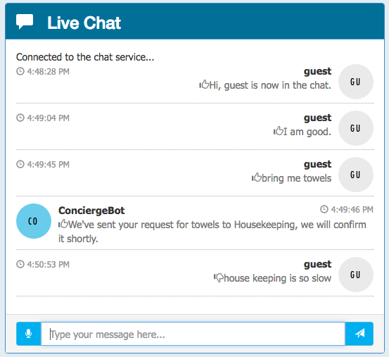

Intelligent analytics

Hands-on lab unguided

March 2018

Information in this document, including URL and other Internet Web site references, is subject to change without notice. Unless otherwise noted, the example companies, organizations, products, domain names, e-mail addresses, logos, people, places, and events depicted herein are fictitious, and no association with any real company, organization, product, domain name, e-mail address, logo, person, place or event is intended or should be inferred. Complying with all applicable copyright laws is the responsibility of the user. Without limiting the rights under copyright, no part of this document may be reproduced, stored in or introduced into a retrieval system, or transmitted in any form or by any means (electronic, mechanical, photocopying, recording, or otherwise), or for any purpose, without the express written permission of Microsoft Corporation.

Microsoft may have patents, patent applications, trademarks, copyrights, or other intellectual property rights covering subject matter in this document. Except as expressly provided in any written license agreement from Microsoft, the furnishing of this document does not give you any license to these patents, trademarks, copyrights, or other intellectual property.

The names of manufacturers, products, or URLs are provided for informational purposes only and Microsoft makes no representations and warranties, either expressed, implied, or statutory, regarding these manufacturers or the use of the products with any Microsoft technologies. The inclusion of a manufacturer or product does not imply endorsement of Microsoft of the manufacturer or product. Links may be provided to third party sites. Such sites are not under the control of Microsoft and Microsoft is not responsible for the contents of any linked site or any link contained in a linked site, or any changes or updates to such sites. Microsoft is not responsible for webcasting or any other form of transmission received from any linked site. Microsoft is providing these links to you only as a convenience, and the inclusion of any link does not imply endorsement of Microsoft of the site or the products contained therein.
© 2018 Microsoft Corporation. All rights reserved.

Microsoft and the trademarks listed at https://www.microsoft.com/en-us/legal/intellectualproperty/Trademarks/Usage/General.aspx are trademarks of the Microsoft group of companies. All other trademarks are property of their respective owners.

**Contents**

<!-- TOC -->

- [Intelligent analytics hands-on lab unguided](#intelligent-analytics-hands-on-lab-unguided)
    - [Abstract and learning objectives](#abstract-and-learning-objectives)
    - [Overview](#overview)
    - [Solution architecture](#solution-architecture)
    - [Requirements](#requirements)
    - [Exercise 1: Environment setup](#exercise-1-environment-setup)
        - [Task 1: Connect to the lab VM](#task-1-connect-to-the-lab-vm)
        - [Task 2: Download and open the ConciergePlus starter solution](#task-2-download-and-open-the-conciergeplus-starter-solution)
        - [Task 3: Create App Services](#task-3-create-app-services)
        - [Task 4: Provision Service Bus](#task-4-provision-service-bus)
        - [Task 5: Provision Event Hubs](#task-5-provision-event-hubs)
        - [Task 6: Provision Azure Cosmos DB](#task-6-provision-azure-cosmos-db)
        - [Task 7: Provision Azure Search](#task-7-provision-azure-search)
        - [Task 8: Create Stream Analytics job](#task-8-create-stream-analytics-job)
        - [Task 9: Start the Stream Analytics Job](#task-9-start-the-stream-analytics-job)
        - [Task 10: Provision an Azure Storage account](#task-10-provision-an-azure-storage-account)
        - [Task 11: Provision Cognitive Services](#task-11-provision-cognitive-services)
    - [Exercise 2: Implement message forwarding](#exercise-2-implement-message-forwarding)
        - [Task 1: Implement the event processor](#task-1-implement-the-event-processor)
        - [Task 2: Configure the Chat Message Processor Web Job](#task-2-configure-the-chat-message-processor-web-job)
    - [Exercise 3: Configure the Chat Web App settings](#exercise-3-configure-the-chat-web-app-settings)
        - [Task 1: Configure the Chat Web App settings](#task-1-configure-the-chat-web-app-settings)
    - [Exercise 4: Deploying the App Services](#exercise-4-deploying-the-app-services)
        - [Task 1: Publish the ChatMessageSentimentProcessor Web Job](#task-1-publish-the-chatmessagesentimentprocessor-web-job)
        - [Task 2: Publish the ChatWebApp](#task-2-publish-the-chatwebapp)
        - [Task 3: Testing hotel lobby chat](#task-3-testing-hotel-lobby-chat)
    - [Exercise 5: Add intelligence](#exercise-5-add-intelligence)
        - [Task 1: Implement sentiment analysis](#task-1-implement-sentiment-analysis)
        - [Task 2: Implement linguistic understanding](#task-2-implement-linguistic-understanding)
        - [Task 3: Implement speech to text](#task-3-implement-speech-to-text)
        - [Task 4: Re-deploy and test](#task-4-re-deploy-and-test)
    - [Exercise 6: Building the Power BI dashboard](#exercise-6-building-the-power-bi-dashboard)
        - [Task 1: Create the static dashboard](#task-1-create-the-static-dashboard)
        - [Task 2: Create the real-time dashboard](#task-2-create-the-real-time-dashboard)
    - [Exercise 7: Enabling search indexing](#exercise-7-enabling-search-indexing)
        - [Task 1: Verifying message archival](#task-1-verifying-message-archival)
        - [Task 2: Creating the index and indexer](#task-2-creating-the-index-and-indexer)
        - [Task 3: Update the Web App web.config](#task-3-update-the-web-app-webconfig)
        - [Task 4: Configure the Search API App](#task-4-configure-the-search-api-app)
        - [Task 5: Re-publish apps](#task-5-re-publish-apps)
    - [After the hands-on lab](#after-the-hands-on-lab)
        - [Task 1: Delete the resource group](#task-1-delete-the-resource-group)

<!-- /TOC -->

# Intelligent analytics hands-on lab unguided

## Abstract and learning objectives

This package is designed to facilitate learning real-time analytics without IoT. Participants will enable intelligent conversation in a machine learning-enabled, real-time chat pipeline to allow hotel guests to chat with one another, and to communicate directly with the concierge. They will also apply analytics to visualize customer sentiment in real-time. After completion, students will be better able to implement a lambda architecture, and enable web-based real-time messaging thru Web Sockets, Event Hubs, and Services Bus. In addition, participants will better understand how to:

-   Leverage Cognitive Services (LUIS & Text Analytics API)

-   Process Events with Web Jobs

-   Index with Search

-   Archive with Cosmos DB

-   Visualize with Power BI Q&A

## Overview

Adventure Works Travel specializes in building software solutions for the hospitality industry. Their latest product is an enterprise mobile/social chat product called Concierge+ (aka ConciergePlus). The mobile web app enables guests to easily stay in touch with the concierge and other guests, enabling greater personalization and improving their experience during their stay. Sentiment analysis is performed on top of chat messages as they occur, enabling hotel operators to keep tabs on guest sentiments in real-time.

## Solution architecture

Below are diagrams of the solution architecture you will build in this lab. Please study this carefully, so you understand the whole of the solution as you are working on the various components.

## Requirements

-   Microsoft Azure subscription must be pay-as-you-go or MSDN.

    -   Trial subscriptions will not work.

-   A virtual machine configured with:

    -   Visual Studio Community 2017 or later

    -   Azure SDK 2.9 or later (Included with Visual Studio 2017)

## Exercise 1: Environment setup

Duration: 60 minutes

Synopsis: The following section walks you through the manual steps to provision the services required using the Azure Portal. Adventure Works has provided a starter solution for you. They have asked you to use this as the starting point for creating the Concierge Plus intelligent chat solution in Azure.

### Task 1: Connect to the lab VM

*Tasks to complete*:

1.  Create an RDP connection to your Lab VM.

2.  Disable Internet Explorer Enhanced Security Configuration.

*Exit criteria*:

-   You have an active session to your Lab VM.

### Task 2: Download and open the ConciergePlus starter solution

*Tasks to complete*:

1.  On your Lab VM, download the ConciergePlus starter solution from the following URL: <http://bit.ly/2wMsqW4>

2.  Unzip the contents to C:\\ConciergePlus\\.

3.  Open the solution in Visual Studio 2017 on your Lab VM.

*Exit criteria*:

-   The ConciergePlusSentiments solution is open in Visual Studio on your Lab VM.

**Note**: If you attempt to build the solution at this point, you will see many build errors. This is intentional. You will correct these in the exercises that follow.

### Task 3: Create App Services

In these steps, you will provision two Web Apps and an API App within a single App Service Plan.

*Tasks to complete*:

1.  Provision a Web App to host the website in an App Service Plan in the Resource Group "intelligent-analytics". Name the Web App something like "ConciergePlusWeb".

2.  Provision another Web App to host a Web Job in the same App Service Plan and Resource Group. Name it something like "ChatProcessorWebJob".

3.  Configure the Web Job Web App to have Always On enabled.

*Exit criteria*:

-   You can navigate to the empty websites for both deployed Web Apps using a web browser.

### Task 4: Provision Service Bus 

In this section, you will provision a Service Bus Namespace and Service Bus Topic.

*Tasks to complete*:

1.  Provision a Service Bus Topic in the same region/resource group as your App Services.

2.  Provision an Event Hub in the same region/resource group as your App Services.

*Exit criteria*:

-   Your Service Bus Topic is listed in the Azure Portal.

### Task 5: Provision Event Hubs

In this task, you will create a new Event Hubs namespace and instance.

*Tasks to complete*:

1.  Provision two Event Hub instances in a new namespace and in the same region/resource group as your App Services. Use a partition count of 32 and message retention of 1 day. The second Event Hub will store messages for archival and be processed by Stream Analytics.

*Exit criteria*:

-   Your Event Hubs are listed in the Azure Portal.

### Task 6: Provision Azure Cosmos DB

In this section, you will provision an Azure Cosmos DB account, a SQL (DocumentDB) Database, and a DocumentDB collection that will be used to collect all the chat messages.

*Tasks to complete*:

1.  Provision a new Azure Cosmos DB account in the same resource group and region as your other services.

2.  Add SQL (DocumentDB) Database.

3.  Add a Collection. The pricing tier should be left at Standard with the Throughput at 1000.

*Exit criteria*:

-   You can view your Collection in the Azure Portal.

### Task 7: Provision Azure Search

In this section, you will create an Azure Search instance.

*Tasks to complete*:

1.  Provision a new instance of Azure Search in the same resource group and region as your other services, at the Basic Pricing tier.

*Exit criteria*:

-   You can view your Azure Search instance in the Azure Portal.

### Task 8: Create Stream Analytics job

In this section, you will create the Stream Analytics Job that will be used to read chat messages from the Event Hub and write them to Azure Cosmos DB.

*Tasks to complete*:

1.  Provision a new Stream Analytics Job in the same region as your other resources.

2.  Add an Input to it that reads from your second Event Hub (the one used for archival). The serialization should be JSON/UTF8.

3.  Add an Output to the Job that targets your Collection in DocumentDB. The Partition Key should be sessionid (all lowercase) and the Document ID messageid (all lower case).

4.  Add a Query that selects all data from the Event Hub and sends it to DocumentDB.

*Exit criteria*:

-   You can view your Stream Analytics instance in the Azure Portal.

### Task 9: Start the Stream Analytics Job

In this section, you will run the Stream Analytics Job that will be used to read chat messages from the Event Hub, and write them to Azure Cosmos DB.

*Tasks to complete*:

1.  Start the Stream Analytics Job.

*Exit criteria*:

-   Your Job starts without error.

### Task 10: Provision an Azure Storage account

The EventProcessorHost requires an Azure Storage Account that it will use to manage its state among multiple instances. In this section, you create that Storage Account.

*Tasks to complete*:

1.  Provision a resource model based Storage Account of type Standard LRS in the same Location and Resource Group as your other services.

*Exit criteria*:

-   You can view your Storage Account in the Portal.

### Task 11: Provision Cognitive Services

To provision access to the Text Analytics API (which provides sentiment analysis features), you will need to provision a Cognitive Services account.

*Tasks to complete*:

1.  Provision a Text Analytics API in the same Location and Resource Group as your other services. Take note of the value of KEY 1.

2.  Provision a Bing Speech API in the same Location and Resource Group as your other services. Take note of the value of KEY 1.

3.  Provision a API Type Language Understanding Intelligent Service (LUIS) in the same Location and Resource Group as your other services. Take note of the value of KEY 1.

*Exit criteria*:

-   You can view your Cognitive Services in the Portal, you should have one for Text Analytics API, another for Bing Speech API, and a third for LUIS.

## Exercise 2: Implement message forwarding

Duration: 45 minutes

In this section, you will implement the message forwarding from the ingest Event Hub instance to an Event Hub instance and a Service Bus Topic. You will also configure the web-based components, which consist of three parts: The Web App UI, a Web Job that runs the EventProcessorHost, and the API App that provides a wrapper around the Search API.

### Task 1: Implement the event processor

In this section, you will run the Stream Analytics Job that will be used to read chat messages from the Event Hub and write them to Cosmos DB.

*Tasks to complete*:

1.  In Visual Studio on your Lab VM, open SentimentEventProcessor.cs, and navigate to the IEventProcessor.ProcessEventsAsync method.

2.  Complete the TODOs numbered 1 through 6.

*Exit criteria*:

-   There are no errors in the IEventProcessor.ProcessEventsAsync method in Visual Studio. Note that at this point the solution will not yet run.

### Task 2: Configure the Chat Message Processor Web Job

Within Visual Studio Solution Explorer, expand the ChatMessageSentimentProcessor project, and open App.Config. You will update the appSettings in this file.

*Tasks to complete*:

1.  Create a Shared Access Policy for Event Hub with Manage, Send, and Listen permissions.

2.  Create a Shared Access Policy for Service Bus with Manage, Send, and Listen permissions.

3.  Copy the connection string from the policy into the eventHubConnectionString setting in the app.config.

4.  Copy the connection string from the policy into the serviceBusConnectionString setting in the app.config.

5.  Set sourceEventHubName to the name of your first Event Hub.

6.  Set destinationEventHubName to the name of your second Event Hub.

7.  Set storageAccountName to the name of the storage account you created.

8.  Set storageAccountKey to the Key for the storage account.

9.  Set chatTopicPath the name of the Service Bus Topic you created.

10. Set textAnalyticsBaseUrl to the Endpoint of the Text Analytics Cognitive Services account. Be sure to include a trailing slash in the URL.

11. Set textAnalyticsAccountName to the Account Name of the Text Analytics Cognitive Services account.

12. Set textAnalyticsAccountKey to the value of KEY 1 from this same Cognitive Services account.

*Exit criteria*:

-   You should have values for all the app settings except LuisAppId and LuisKey.

## Exercise 3: Configure the Chat Web App settings

Duration: 10 minutes

Within Visual Studio Solution Explorer, expand the ChatWebApp project and open Web.Config. You will update the appSettings in this file.

### Task 1: Configure the Chat Web App settings 

*Tasks to complete*:

1.  Copy the connection string from the Event Hub policy you created into the eventHubConnectionString setting.

2.  Copy the connection string from the Service Bus policy you created into the serviceBusConnectionString setting.

3.  Set eventHubName to the name of your first Event Hub.

4.  Set chatTopicPath to the name of the Service Bus Topic you created.

5.  Set chatRequestTopicPath to the name of the Service Bus Topic you created.

*Exit criteria*:

-   You should have values for all the app settings except chatSearchApiBase.

## Exercise 4: Deploying the App Services

Duration: 15 minutes

With the App Services projects properly configured, you are now ready to deploy them to their pre-created services in Azure.

### Task 1: Publish the ChatMessageSentimentProcessor Web Job

*Tasks to complete*:

1.  Publish the ChatMessageSentimentProcessor Web Job with a run mode of Run Continuously to the Web App you had provisioned for it.

*Exit criteria*:

-   The Output dialog indicates your publish was successful.

### Task 2: Publish the ChatWebApp

*Tasks to complete*:

1.  Publish the ChatWebApp to the Web App you had provisioned for it.

*Exit criteria*:

-   A browser window should appear with content similar to the following:
    
    

### Task 3: Testing hotel lobby chat

*Tasks to complete*:

1.  Open a browser instance and navigate to the deployed Web App.

2.  Join the chat.

3.  Repeat with one or more additional browser tabs or from different a device and browser.

4.  Start a conversation between these users in the Hotel Lobby.

*Exit criteria*:

-   You should see your messages appear in all other browser instances joined to the chat.

## Exercise 5: Add intelligence

Duration: 60 minutes

In this exercise, you will implement code to activate multiple cognitive intelligence services that act on the chat messages.

### Task 1: Implement sentiment analysis

In this task, you will add code that enables the Event Processor to invoke the Text Analytics API using the REST API and retrieve a sentiment score (a value between 0.0, negative, and 1.0, positive sentiment) for the text of a chat message.

*Tasks to complete*:

1.  Complete the TODOs numbered 7 through 11 in the GetSentimentScore method.

2.  Complete TODO 12 in the ProcessEventsAsync method.

*Exit criteria*:

-   You should see no errors in either the GetSentimentScore or ProcessEventsAsync methods.

### Task 2: Implement linguistic understanding

In this task, you will create a LUIS app, publish it, and then enable the Event Processor to invoke LUIS using the REST API.

*Tasks to complete*:

1.  Use <http://www.luis.ai> to create a new App.

2.  Set the App Settings in the LUIS website to use your subscription key (KEY 1) from your LUIS Account setup in the Azure Portal and activate it.

3.  Add an intent named OrderIn with an example utterance of "order a pizza."

4.  Add an entity named RoomService with hierarchical children FoodItem and RoomItem.

5.  Review the label for the utterance "order a pizza" and set the intent to OrderIn and entity (pizza) to FoodItem.

6.  Add new utterances for "Bring me toothpaste", "Bring me blankets", "Order a soda", and "Order me a pizza."

7.  Train the model.

8.  Publish the model.

9.  Test the model with the query "order me a pizza" and verify you get the intent of OrderIn (with a score close to 1.0) and entity pizza with a type of "RoomService::FoodItem".

1. Copy the App ID and Subscription Key from your LUIS app into the App.config of the ChatMessageSentimentProcessor project, to the luisAppID and luisKey settings respectively.

11. Complete TODO 13 in SentimentEventProcessor.cs.

12. Update the \_luisBaseUrl in SentimentEventProcessor.cs to match that base URL from your LUIS app.

*Exit criteria*:

-   All TODO items in SentimentEventProcessor.cs should be completed.

### Task 3: Implement speech to text

There is one last intelligence service to activate in the application---speech recognition. This is powered by the Bing Speech API, and is invoked directly from the web page without going through the web server. In the section that follows, you insert your Cognitive Services Speech API key into the configuration to enable speech to text.

*Tasks to complete*:

1.  Add your Speech API Key under the TODO in scripts\\chatClient.js of the ChatWebApp project.

*Exit criteria*:

-   You should have all TODO items complete in chatClient.js.

**Note**: Embedding the API Key as shown here is done only for convenience. In a production app, you will want to maintain your API Key server-side.

### Task 4: Re-deploy and test

Now that you have added sentiment analysis, language understanding, and speech recognition to the solution, you need to re-deploy the apps so you can test out the new functionality.

*Tasks to complete*:

1.  Publish the ChatMessageSentimentProcessor.

2.  Publish ChatWebApp.

*Exit criteria*:

-   Open a browser and navigate to your deployed website using HTTPS. Use multiple browser instances or tabs to simulate multiple users.

-   Send chat messages between them and verify that you see the sentiment indicator (a thumbs up or thumbs down icon next to each chat message).

-   You can order something from room service, like "bring me towels" and you get a response from the ConciergeBot.

-   You can select the microphone to the left of the text box and speak for two to three seconds. Your spoken message should appear.

    

## Exercise 6: Building the Power BI dashboard

Duration: 30 minutes

Now that you have the solution deployed and exchanging messages, you can build a Power BI dashboard that monitors the sentiments of the messages being exchanged in real time. The following steps walk through the creation of the dashboard.

### Task 1: Create the static dashboard

*Tasks to complete*:

1.  Using PowerBI.com, create a new report from your streamed dataset that contains a semi-circular gauge. It should chart the average score, with a range of 0.0 to 1.0.

*Exit criteria*:

-   Your report should look like the following:
    
    

### Task 2: Create the real-time dashboard

This gauge is currently a static visualization. You will use the report just created to seed a dashboard whose visualizations update as new messages arrive.

*Tasks to complete*:

1.  Create a new dashboard by pinning the gauge you created previously.

2.  Open the new dashboard.

3.  Enter the QA query "average score created between yesterday and today" and visualize it with the Gauge chart.

4.  Format the chart so it ranges from 0.0 to 1.0 and has an indicator at 0.5.

5.  Pin this visual to the dashboard you created.

6.  Delete the old static chart from the dashboard.

7.  Navigate to the ConciergePlus website and send some messages, observing that your Gauge updates in real time.

8.  Add three additional visualizations so your dashboard looks as follows:
    
    

*Exit criteria*:

-   Your chart should update in real-time and appear as above.

## Exercise 7: Enabling search indexing

Duration: 30 minutes

Now that you have primed the system with some messages, you will create a Search Index and an Indexer in Azure Search upon the messages that are collected in Azure Cosmos DB.

### Task 1: Verifying message archival

Before going further, a good thing to check is whether messages are being written to Azure Cosmos DB from the Stream Analytics Job.

*Tasks to complete*:

1.  Using the Azure Portal, navigate to Data Explorer for your Cosmos DB Collection.

*Exit criteria*:

-   You should see a list of document IDs, similar to the following:
    
    

    

### Task 2: Creating the index and indexer

*Tasks to complete*:

1.  In your Azure Search Index, use the Connect to your data feature to index the collection.

2.  Provide any name for the index, but leave the Key set to id.

3.  Ensure that the id, message, createDate, and username are Retrievable.

4.  Ensure that createDate, username, and sessionId are Filterable.

5.  Ensure that create date, username, and sessionId are Sortable.

6.  Ensure that the message field is Searchable.

7.  Create an Indexer with a 5-minute interval that starts today.

*Exit criteria*:

-   After a few moments, your indexer status should appear similar to the following:
    
    

### Task 3: Update the Web App web.config

*Tasks to complete*:

1.  Modify the web.config of the ChatWebApp project.

2.  Set the chatSearchApiBase to the URI of the deployed Search API app.

*Exit criteria*:

-   You should have all app settings completed with values in the web.config.

### Task 4: Configure the Search API App

*Tasks to complete*:

1.  Modify the web.config of the ChatApi project.

2.  Set the SearchServiceName to the name of your Search service.

3.  Set the SearchServiceQueryApiKey to the Key of your Search service.

4.  Set the SearchIndexName to the name of the Index you created in Search.

*Exit criteria*:

-   You should have all app settings completed with values in the web.config.

### Task 5: Re-publish apps

*Tasks to complete*:

1.  Publish the ChatWebApp.

2.  Publish the ChatApiApp to your API App.

*Exit criteria*:

-   Navigate to the Search tab on the deployed Web App and try searching for chat messages. (Note that there is up to a 5-minute latency before new messages may appear in the search results.)
    
    

## After the hands-on lab 

Duration: 10 Minutes

In this exercise, attendees will deprovision any Azure resources that were created in support of the lab. You should follow all steps provided *after* attending the Hands-on lab.

### Task 1: Delete the resource group

1.  Using the Azure portal, navigate to the Resource group you used throughout this hands-on lab by selecting Resource groups in the left menu.

2.  Search for the name of your research group and select it from the list.

3.  Select Delete in the command bar and confirm the deletion by re-typing the Resource group name and selecting Delete.

